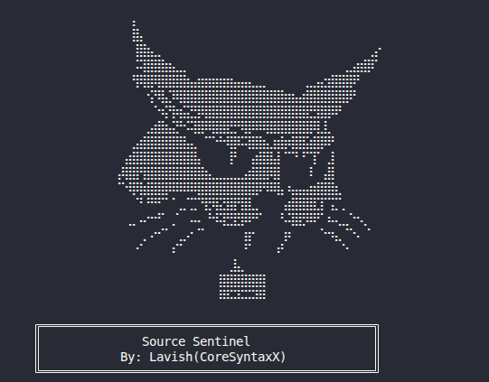

# SourceSentinel

Multi-language source code security scanner and vulnerability detector.



**What It Does**
- Collects source files from local paths, Git repositories, GitHub, and websites
- Runs a processing pipeline (minified detection, beautify, deobfuscate, normalize, tokenize)
- Performs JavaScript-focused security analysis (DOM XSS sinks, dangerous functions, jQuery sinks, prototype pollution, unsafe assignments, client-side secrets)
- Runs cross-language detectors (regex patterns, secrets, JWT issues, entropy heuristics, structural/info disclosure checks)
- Generates reports in JSON, HTML, Markdown, or console output

**Quickstart**
```bash
pip install -e .

# Local path scan
sourcesentinel ./path/to/project

# Web scan (auto-detects web target if no --type given)
sourcesentinel example.com

# GitHub scan
sourcesentinel https://github.com/org/repo --type github
```

**Requirements**
- Python 3.8+
- Optional extras for web crawling and GitHub integration

**Installation**
```bash
# Standard install
pip install .

# Editable install (development)
pip install -e .

# Optional extras
pip install -e ".[dev]"
pip install -e ".[web]"
pip install -e ".[github]"
pip install -e ".[all]"
```

**CLI Usage**
```bash
sourcesentinel [target] [options]
```

**Targets and Auto-Detection**
- Local path: existing file or directory on disk
- Web: URL or domain (if no scheme is provided it is treated as `https://...`)
- GitHub: `github.com/...` or a full GitHub URL
- Git: SSH-style `git@host:org/repo.git`

If `--type` is not provided, SourceSentinel attempts to infer the target type from the target string. If it cannot determine the type, it defaults to `web`.

**Common Options**
- `--type` / `--target-type`: `local`, `web`, `github`, `git`
- `--mode`: `fast`, `normal`, `deep`
- `--output`: output directory (default `./reports`)
- `--format`: `json`, `html`, `markdown`, `console`
- `--strict`: only include findings with confidence >= 0.8 and severity MEDIUM+
- `--include-ext`: include extensions (repeatable)
- `--exclude-ext`: exclude extensions (repeatable, default `.min.js`, `.map`, `.log`)
- `--max-size`: max file size in MB (default 10)
- `--workers`: number of worker threads (default CPU count)
- `--timeout`: timeout per file in seconds (default 30)
- `--verbose`, `--debug`, `--quiet`

**Collector Options**
- `--github-token`: GitHub token for private repos and higher rate limits
- `--git-branch`: Git branch (default `main`)
- `--include-uncommitted`: include uncommitted Git files
- `--web-depth`: crawl depth (default 3)
- `--web-pages`: maximum pages to crawl (default 100)
- `--ignore-pattern`: glob patterns to ignore (repeatable)

**Examples**
```bash
# Scan current directory (auto-detects local)
sourcesentinel . --type local

# Limit to JS + HTML
sourcesentinel ./app --include-ext .js --include-ext .html

# Deep scan with HTML report
sourcesentinel ./app --mode deep --format html --output ./reports

# GitHub scan with token
sourcesentinel https://github.com/org/repo --type github --github-token $GITHUB_TOKEN

# Web crawl with tighter limits
sourcesentinel https://example.com --type web --web-depth 2 --web-pages 25
```

**Reports**
- Output directory defaults to `./reports`
- JSON reports are optimized for machine consumption and include finding snippets
- HTML/Markdown reports include a summarized view for humans
- Console output prints a summary to stdout

A JSON report contains:
- `metadata`: scan target, duration, mode, totals
- `findings`: title, severity, file location, snippet, and context
- `sensitive_paths`: aggregated high-risk path hits

**Rules and Detectors**
- Regex rules are loaded from `src/config/rules` at runtime
- Current rule files include `src/config/rules/javascript/api_keys.yaml` and `src/config/rules/javascript/dom_xss.yaml`
- The rule engine is extensible; adding YAML files under `src/config/rules` automatically loads them

**Pipeline Overview**
1. Collect files into an organized staging directory
2. Pre-process (minified detection, beautify, deobfuscate, normalize, tokenize)
3. Analyze JavaScript with AST support when `esprima` is installed
4. Run cross-language detectors (patterns, secrets, JWT, entropy, structural)
5. Generate reports

**JavaScript Analysis (Current)**
- DOM XSS sinks (e.g., `innerHTML`, `document.write`, `outerHTML`)
- Dangerous functions (`eval`, `Function`, string-based `setTimeout`/`setInterval`)
- jQuery sinks (`.html()`, `.append()`, `.prepend()`, `.before()`, `.after()`)
- Prototype pollution and unsafe assignment patterns
- Client-side secrets in source

**Cross-Language Detectors**
- Secrets detector for API keys, tokens, and credentials
- JWT detector for leaked tokens and weak configuration
- Entropy detector for suspicious high-entropy strings (not run in `fast` mode)
- Structural detector for debug code, exposed endpoints, info disclosure, and insecure config
- Pattern detector using YAML rule definitions

**Scan Modes**
- `fast`: skips entropy and AST-heavy analysis to reduce runtime
- `normal`: balanced default
- `deep`: enables more thorough checks (still bounded by timeout and max size)

**Configuration**
- CLI supports `--config`, but configuration file loading is not wired into the scan pipeline yet
- Use CLI flags to control behavior until config loading is implemented

**Current Limitations**
- PHP and HTML analyzers exist in `src/analyzers`, but are not registered in the pipeline yet
- SARIF reporter exists in code (`src/reporting/sarif_reporter.py`) but is not exposed via CLI
- Tests are not included in this repository yet

**Project Layout**
- `src/main.py`: CLI entry point
- `src/engine/`: orchestrator, pipeline, rule engine
- `src/collectors/`: local, web, GitHub, and Git collectors
- `src/analyzers/`: language analyzers (JavaScript active)
- `src/detectors/`: secrets, JWT, entropy, structural, regex patterns
- `src/processors/`: normalization, beautification, tokenization, deobfuscation
- `src/reporting/`: JSON, HTML, Markdown, console reporters
- `src/config/rules/`: YAML rule definitions
- `docs/`: collector documentation and examples
- `reports/`: generated scan reports
- `scanner.log`: runtime logs

**Docs**
- Collector docs: `docs/collectors.md`
- Collector configuration examples: `docs/collectors_config_examples.md`

**License**
MIT
